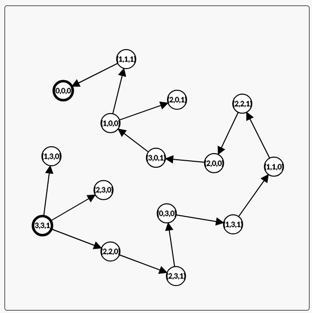

# 1
    siehe KI.py

<picture></picture>
# 2
## 1
    siehe src/Everything.java

    Ich habe mich dagegen entschieden aima.core.search zu benutzen da die verwendung von maven
    und die Kopfschmerzen die es jedesmal bereitet aufwendiger sind als es selbst zu implementieren.

    
    Tiefen Suche brauch 6 Schritte und läuft aus dummen glück den kürzesten weg,
    da die weg findung von Tiefen suche von der Implementierung abhängt ist es hier nur glück.

    Breiten Suche braucht8 Schritte.
    A Stern suche braucht mit gegebenen Heuristik 9 Schritte bei eine Heuristik die immer 0 ist werden nur 5 Schritte benötigt.
    Auch nach einer korrektur der Heuristik werden mit heursitck noch 8 Schritte benötigt.
    
## 2
    Die Abschätzungen sind nicht zulässig und dürfen daher nicht verwendet werden, da der die Strecke für Nürnberg größer ist als in Echt.

# 3
    Eine Heuristick ist Dominant, wenn sie in jedem aspekt größer ist als eine andere heuristik aber trozdem legal ist.
    Eine Heuristick funktioniert sogut wie sie der realität ähnelt, eine Heuristick die dominant ist ist näher ander relatiät und führt dazu, dass der erwartet weg besser passt.
    Eine deutlich zu kleine Heuristik kann den algorithmus in die Falsche richtung locken.
